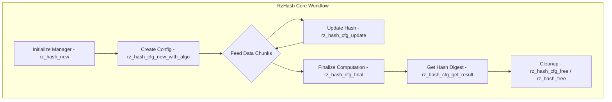

# RzHash

The Rizin hashing library, `RzHash`, offers a unified interface to various hashing algorithms, allowing other modules and users to easily compute and work with hash digests.

The `RzHash` structure holds all information needed for a hashing operation with a specific algorithm. Once initialized, data can be fed into the hash context incrementally. Finally, the computed hash digest can be retrieved. This design allows for efficient hashing of large data sets or streaming data without requiring the entire content to be in memory at once.

## What can I expect here?
- For a comprehensive list of supported hash algorithms and their corresponding flags, please refer to the `rz_hash.h` header file.
- A primary context `RzHash` for managing hashing operations.
- Core functions for the hashing lifecycle:
    - `rz_hash_new()`: To initialize a hash context with a specific algorithm.
    - `rz_hash_update()`: To feed data to the hash context.
    - `rz_hash_final()`: To compute the final hash digest.
    - `rz_hash_free()`: To release the hash context.
- Plugin-based architecture for extending supported hash algorithms.
- Helper functions for one-shot hashing of common algorithms like XXH32, entropy, and ssdeep.

## Architecture

The `RzHash` library employs a plugin-based architecture to manage and provide various hashing algorithms.

The `RzHash` structure serves as the manager for the available hashing plugins. To perform actual hashing operations, you create an `RzHashCfg` configuration from an `RzHash` instance.

- **`RzHash` Context**: This is the factory and plugin manager. You initialize it once (e.g., `rz_hash_new()`).
- **`RzHashCfg` Configuration**: This holds the state for a specific hashing operation (or multiple algorithms simultaneously). You create it using `rz_hash_cfg_new_with_algo(hash_ctx, "algorithm_name", ...)` or `rz_hash_cfg_new(hash_ctx)` followed by `rz_hash_cfg_configure()`.

- **RzHash Core Workflow**


## Usage and Examples

### Example: Calculating an MD5 Hash

```c
#include <rz_hash.h>
#include <stdio.h>
#include <string.h>

int main_md5_example(void) {
  RzHash *ctx = rz_hash_new();
  if (!ctx) {
      return 1;
  }

  // Initialize the hash configuration for MD5
  RzHashCfg *cfg = rz_hash_cfg_new_with_algo(ctx, "md5", NULL, 0);
  if (!cfg) {
      rz_hash_free(ctx);
      return 1;
  }

  const char *data = "Hello, world!";

  // Update the hash context with the data
  rz_hash_cfg_update(cfg, (const ut8 *)data, strlen(data));

  // Finalize the hash computation
  rz_hash_cfg_final(cfg);

  // Get and print the hash digest
  char *hex_digest = rz_hash_cfg_get_result_string(cfg, "md5", NULL, false);
  if (hex_digest) {
    printf("%s\n", hex_digest);
    free(hex_digest);
  }

  // Free the hash context
  rz_hash_cfg_free(cfg);
  rz_hash_free(ctx);
  return 0;
}
```
