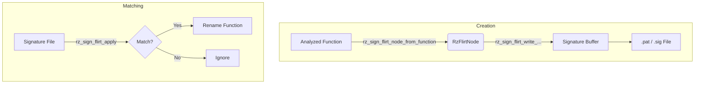

# RzSign

`RzSign` module provides functionality to work with signatures, primarily focusing on FLIRT (Fast Library Identification and Recognition Technology) signatures. It allows creating, loading, and applying signatures to identify functions in a binary.

## FLIRT Signatures

FLIRT signatures are used to identify library functions in stripped binaries. They rely on pattern matching of the function's code bytes (variant and non-variant bytes) and CRC checksums.

### File Formats

FLIRT signatures can be stored in two formats:

- **.pat (Pattern file)**: Human-readable text format. Each line describes one function signature with its byte pattern, CRC, size, and symbol name. Easy to create and debug.
- **.sig (Signature file)**: Compressed binary format. More compact but not human-readable. Rizin can parse both formats.

The `.pat` format is typically used during signature development, while `.sig` files are distributed for production use.

### Pattern Format

A FLIRT pattern consists of byte values in hexadecimal. Some bytes are **fixed** (must match exactly) while others are **variant** (can match any value). Variant bytes are represented with `..` (two dots).

**Example pattern:**
```
5589E583EC..894DF8....................C745FC00000000
```

- `55 89 E5 83 EC` - Fixed bytes (must match exactly)
- `..` - Variant byte (matches any value, typically for relocations or offsets)
- `89 4D F8` - More fixed bytes
- `....................` - Multiple variant bytes (10 pairs = 10 bytes)
- `C7 45 FC 00 00 00 00` - Fixed bytes

### .pat File Line Format

A complete `.pat` line includes:
```
<pattern> <pattern_len> <crc16> <func_size> <symbols> [tail_bytes]
```

**Example:**
```
5589E583EC..894DF8 00 0000 0040 :0000 my_function
```
- Pattern: `5589E583EC..894DF8` (with variant bytes)
- Pattern length: `00` (length of pattern after the prelude)
- CRC16: `0000`
- Function size: `0040` (64 bytes in hex)
- Symbol: `:0000 my_function` (public function at offset 0)

### Key Structures

- `RzFlirtNode`: Represents a node in the signature tree. It contains a byte pattern and mask.
- `RzFlirtModule`: Represents a specific module (function or group of functions) associated with a pattern. It includes CRC checksums and function names.
- `RzFlirtFunction`: Represents a function within a module.

### API Usage

#### Creating Signatures

To create a signature from an analyzed function:
1. Ensure the function is analyzed (`RzAnalysisFunction`).
2. Use `rz_sign_flirt_node_from_function()` to generate a `RzFlirtNode` from the function.
3. Use `rz_sign_flirt_write_string_pattern_to_buffer()` to serialize the node to a `.pat` format string.

#### Matching Signatures

To match signatures against an analysis context:
1. Load the signature file (either `.sig` binary or `.pat` text).
2. Use `rz_sign_flirt_apply()` to apply the signature file to the current `RzAnalysis` instance.
   - This function parses the file, matches patterns against analyzed functions, and renames them if a match is found.


### Workflow



## Rizin Signature Database

Rizin maintains a community signature database with pre-built signatures for common libraries.

### Repository Structure

The signature ecosystem consists of three repositories:

| Repository | Purpose |
|------------|---------|
| [sigdb](https://github.com/rizinorg/sigdb) | Pre-built `.sig` files, auto-pulled during Rizin build via meson |
| [sigdb-source](https://github.com/rizinorg/sigdb-source) | Source `.pat` files where contributors submit new signatures |
| [sigdb-tools](https://github.com/rizinorg/sigdb-tools) | Tools to convert `.pat` files to `.sig` format |

### Contributing Signatures

To contribute new signatures to the Rizin signature database:

1. **Create the folder structure** in `sigdb-source`:
   ```
   <bin_format>/<arch>/<bits>/<library>/
   ```
   Where:
   - `<bin_format>`: Binary format (e.g., `elf`, `pe`) - see `rz-bin -L`
   - `<arch>`: Architecture (e.g., `x86`, `arm`) - see `rz-asm -L`  
   - `<bits>`: Architecture bits (e.g., `32`, `64`)

2. **Add required files**:
   - `<library>.pat` - The pattern file
   - `<library>.description` - Human-readable description (max 1024 chars)
   - `<library>.src.sha1` - SHA1 of original source files

3. **Example**:
   ```bash
   mkdir -p sigdb-source/elf/x86/32/mylib
   echo "My Library v1.0" > sigdb-source/elf/x86/32/mylib/mylib.description
   sha1sum original.a > sigdb-source/elf/x86/32/mylib/mylib.src.sha1
   # Add your .pat file
   cp signature.pat sigdb-source/elf/x86/32/mylib/mylib.pat
   ```

4. Submit a pull request to [sigdb-source](https://github.com/rizinorg/sigdb-source).
