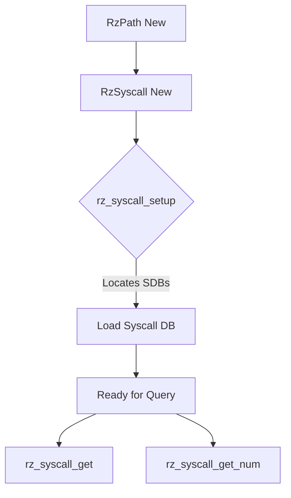

# RzSyscall

`RzSyscall` provides functionality to manage system calls and system registers for different architectures and operating systems. It allows mapping between syscall numbers and names, as well as resolving system register values.

## Architecture

The core structure is `RzSyscall`, which holds the database of system calls loaded from SDB files.

### Key Structures

- `RzSyscall`: Main handle, contains the SDB database and context information (OS, Arch, CPU, Bits).
- `RzSyscallItem`: Represents a single system call with its name, number, arguments, etc.
- `RzPath`: Helper structure used during initialization to locate SDB files.

### Workflow



## Usage

Using `RzSyscall` involves the following steps:

1.  **Initialize `RzPath`**: Create an `RzPath` instance to help locate system files.
2.  **Create `RzSyscall`**: Allocate a new `RzSyscall` instance.
3.  **Setup**: Configure the instance with the desired OS, Architecture, and bitness using `rz_syscall_setup()`.
4.  **Query**: Use functions like `rz_syscall_get()` or `rz_syscall_get_num()` to resolve syscalls.

## Example: Resolving a Syscall on Linux x86_64

```c
#include <rz_syscall.h>
#include <rz_util.h>
#include <stdio.h>

int main(void) {
	// 1. Create RzPath to locate SDB files
	RzPath *path = rz_path_new();
	if (!path) {
		fprintf(stderr, "Failed to create RzPath\n");
		return 1;
	}

	// 2. Create RzSyscall instance
	RzSyscall *sc = rz_syscall_new();
	if (!sc) {
		fprintf(stderr, "Failed to create RzSyscall\n");
		rz_path_free(path);
		return 1;
	}

	// 3. Setup for Linux x86_64
	// rz_syscall_setup(sc, path, arch, bits, cpu, os)
	if (!rz_syscall_setup(sc, path, "x86", 64, NULL, "linux")) {
		fprintf(stderr, "Failed to setup RzSyscall for linux-x86-64\n");
		rz_syscall_free(sc);
		rz_path_free(path);
		return 1;
	}

	// 4. Query a syscall (e.g., write = 1 on Linux x86_64)
	int syscall_num = 1;
	RzSyscallItem *item = rz_syscall_get(sc, syscall_num, -1);
	if (item) {
		printf("Syscall %d on Linux x86_64 is '%s'\n", syscall_num, item->name);
		rz_syscall_item_free(item);
	} else {
		printf("Syscall %d not found\n", syscall_num);
	}

	// Cleanup
	rz_syscall_free(sc);
	rz_path_free(path);
	return 0;
}
```

## Syscall Database (SDB)

The syscall database is stored in `librz/syscall/d` as plain text files with the `.sdb.txt` extension. These files are compiled into binary SDB files during the build process.

### File Format

Each line represents a syscall definition in the following format:

```
name=swi,num,args,types
```

- **name**: Name of the syscall (e.g., `write`, `open`).
- **swi**: Software interrupt number (usually `0x80` for Linux x86).
- **num**: Syscall number.
- **args**: Number of arguments.
- **types**: String representing the types of arguments (optional).

**Key-Value Pairs for Lookup:**

The SDB file assumes specific keys for lookup:
- `_`: Stores the default SWI number (e.g., `_=0x80`).
- `name`: Lookup by name (e.g., `write` -> `0x80,1,3,izi`).
- `swi.num`: Lookup by SWI and number (e.g., `0x80.1` -> `write`).

### Adding a New Database

1. Create a new file in `librz/syscall/d/` named `<os>-<arch>-<bits>.sdb.txt`.
2. Populate it with syscall definitions.
3. Add the new file to `librz/syscall/d/meson.build` to ensure it gets compiled and installed.
